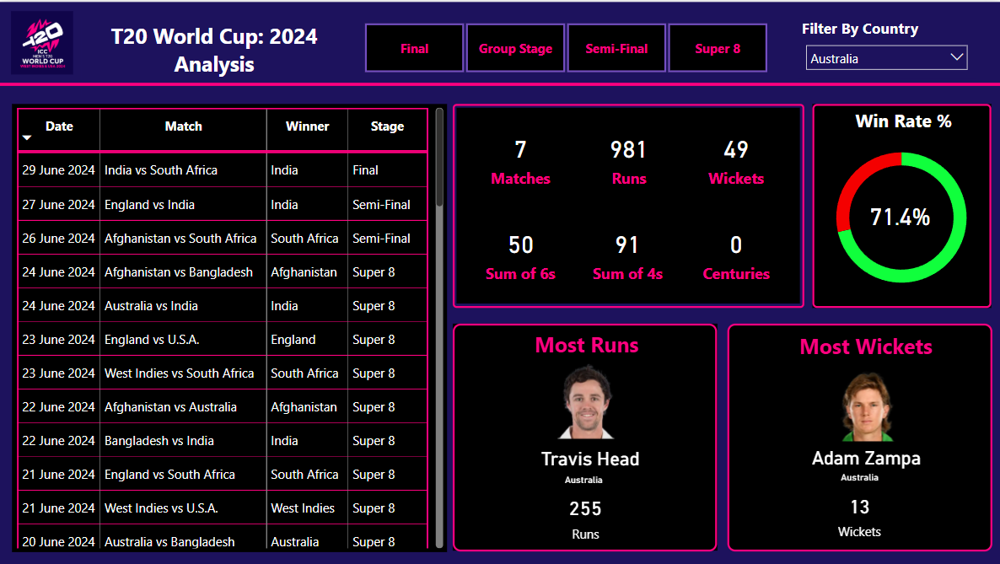

# ICC Men's T20 Cricket World Cup 2024 Data Analytics

This project focuses on analyzing the data from the **ICC Men's T20 World Cup 2024** using Python and Power BI, providing valuable insights into player and team performance. The analysis is presented across 7 pages, each focusing on different aspects of the tournament.

## Pages Overview

### 1. **Overall Tournament Analysis**
   - Provides an overview of the entire tournament, showcasing key statistics such as total runs scored, wickets taken, win percentages, and match results across all teams.
   - Visualizations include bar charts, pie charts, and trends over the course of the tournament.

   

### 2. **Player Analysis**
   - This section dives deeper into player performance across different roles in the game. It is subdivided into several categories:
   
   #### 2.1: **Openers**
   - Focuses on the performance of opening batsmen, their runs, strike rates, and average scores across the tournament.
   
   
   
   #### 2.2: **Middle Order**
   - Analyzes the performance of middle-order batsmen, evaluating their impact in terms of stability, strike rate, and runs scored in pressure situations.
   
   
   
   #### 2.3: **Finishers**
   - Examines the performance of finishers—players who contribute to completing the innings and hitting crucial boundaries in the final overs.
   
   
   
   #### 2.4: **All-Rounders**
   - A detailed analysis of players who have excelled with both bat and ball. This includes their contribution to the team's overall performance in all aspects of the game.
   
   
   
   #### 2.5: **Bowlers**
   - Focuses on the performance of bowlers, highlighting key metrics such as economy rates, wickets taken, and their effectiveness in different match situations.

   

### 3. **Final 11 (Best)**  
   - Based on the analysis, this page identifies the **best 11 players** of the tournament. This includes the top performers across all categories—batsmen, bowlers, and all-rounders—who have shown exceptional skills and contributed significantly to their team's success.

   

